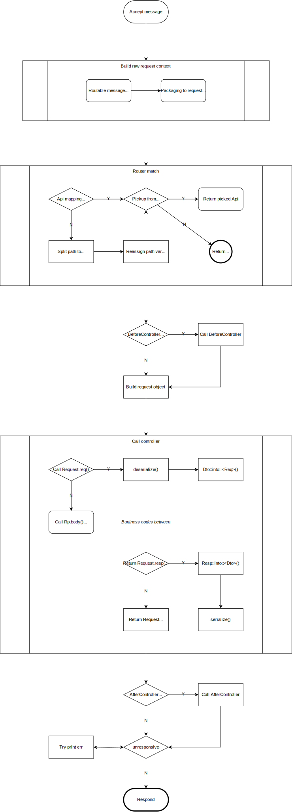

*[点击这里查看中文文档](assets/docs/README-zh.md)*

Almost all applications provide interactive interfaces. Due to different protocols, there is no unified routing rule for different types of interfaces, which may lead to a chaotic program structure and make it difficult to control various interfaces in a unified and convenient way. To address this issue, DCE provides a standard router and encapsulates the characteristics of routable protocols. For interfaces without standard URI paths, as long as they implement the routable protocol trait, they can be uniformly routed through the DCE router.

> *DCE was originally a PHP-written network programming framework that integrated a router, HTTP/TCP servers, and some other features. Due to a fascination with RUST, the author moved it over. Currently, only the distinctive router has been moved, and in the future, the session manager will also be moved, while most other features will not.*

The DCE router package is located in `crates/router`, and examples of routable protocol implementations are located in `crates/protocols`. The application example code for the DCE router is under the `src` directory. The directory structure is explained as follows:

```
[ROOT]
├──assets                               Resource directory
│  ├──templates                         HTML and other template directory
├──crates                               Crate directory
│  ├──protocols                         Routable protocol implementation package directory
│  │  ├──cli                            CLI routable protocol implementation
│  │  ├──hyper                          Hyper HTTP routable protocol implementation
│  │  ├──tokio                          Tokio TCP/UDP routable protocol implementation (this implementation is example code and not recommended for direct use in real projects)
│  │  ├──tokio-tungstenite              Tokio Tungstenite WebSocket routable protocol implementation (this implementation is example code and not recommended for direct use in real projects)
│  ├──router                            DCE router package
│  │  ├──macro                          DCE router macro package
├──src                                  DCE application example code
│  ├──apis                              Route interface example code
```

Regarding routable protocol trait, since HTTP and CLI have standard path addresses for routing, these implementations are generally applicable to real projects. For other implementations such as TCP routable protocol, they are currently mainly used as example code because communication protocols like TCP usually define a new business protocol on top, and they do not have a unified standard. Therefore, users need to implement the corresponding routable protocol to adapt to the DCE router.

**In addition to basic routing functionality, the DCE router also provides a global controller pre-event interface, and the Request object provides data conversion and serialization utility interfaces:**
- The global controller pre-event interface can perform some pre-processing work, such as global permission control, which is very convenient to do here.
- Data converter, used for conversion between `DTO` and `ENTITY`. By implementing the `From/Into` traits, operations such as desensitization can be performed on entity data, converting it into a data structure suitable for transmission.
- Serialization interface used to encode `DTO` for transmission or parse `sequences` into `DTO` for conversion into entity objects. The specific serialization tool is configured through the `api` macro.

#### Routing Performance:

Due to the very short process chain, as it directly calls the controller after matching the API by path, so the performance is very high. For regular path APIs, it directly matches the path from the API hash table, with a time complexity of O(1). For variable path APIs, if there is only one variable in the path, the time complexity is O(n), and if there are multiple variables, it increases exponentially. Therefore, it is recommended to use regular paths, or ensure that the number of variables in variable paths is as small as possible, or ensure that there are as few peer variables as possible to achieve the highest routing performance.

#### Complete Routing Flowchart:


#### DCE Router Usage Example:

*For more complete examples, please refer to the [src](src) directory, and for a more detailed document, click [here](https://docs.rs/dce).*

```rust
use rand::random;
use serde::Serialize;
use dce_cli::protocol::{CliProtocol, CliConvert, CliRaw};
use dce_router::{api, openly_err};
use dce_router::router::router::Router;
use dce_router::router::serializer::JsonSerializer;

#[tokio::main]
async fn main() {
    let router = Router::new()
        .push(hello)
        .ready();

    CliProtocol::new(1).route(router.clone(), Default::default()).await;
}

/// `cargo run --package dce --bin app -- hello`
/// `cargo run --package dce --bin app -- hello DCE`
#[api("hello/{target?}")]
pub async fn hello(req: CliRaw) {
    let target = req.param("target")?.get().unwrap_or("RUST").to_owned();
    req.raw_resp(format!("Hello {} !", target))
}

/// `cargo run --package dce --bin app -- session`
/// `cargo run --package dce --bin app -- session --user DCE`
#[api(serializer = JsonSerializer{})]
pub async fn session(mut req: CliConvert<User, UserDto>) {
    let name = req.rpi_mut().args_mut().remove("--user").ok_or_else(|| openly_err!(r#"please pass in the "--user" arg"#))?;
    let resp = User {
        nickname: name.clone(),
        gender: if random::<u8>() > 127 { Gender::Female } else { Gender::Male },
        name,
        cellphone: "+8613344445555".to_owned(),
    };
    req.resp(resp)
}

#[derive(Serialize)]
pub enum Gender {
    Male,
    Female,
}

pub struct User {
    nickname: String,
    gender: Gender,
    #[allow(dead_code)]
    name: String,
    #[allow(dead_code)]
    cellphone: String,
}

#[derive(Serialize)]
pub struct UserDto {
    nickname: String,
    gender: Gender,
}

impl From<User> for UserDto {
    fn from(value: User) -> Self {
        Self {
            nickname: value.nickname,
            gender: value.gender,
        }
    }
}
```