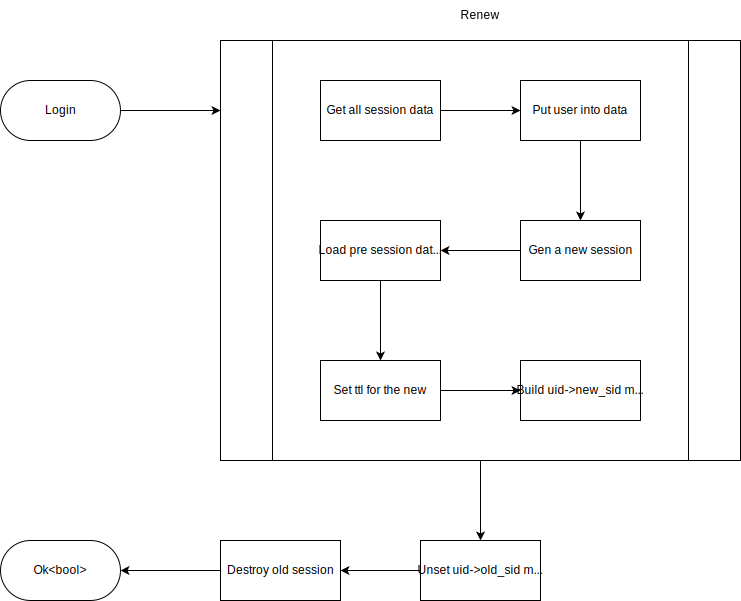
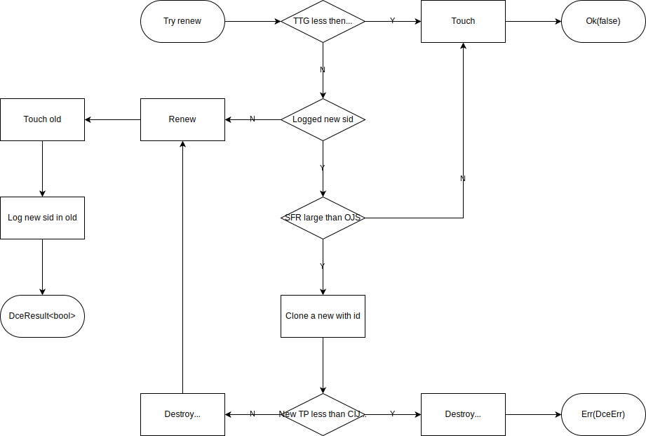

`dce-session`是一个通用会话管理器（非`dce`专用，任意项目皆可接入），它包括基础会话管理、用户会话管理、连接会话管理、自重生会话管理及redis版前述所有会话管理器的实现。

### 基础会话管理特征

基础会话管理特征主要包括一些基本的会话储存接口，如`get`、`set`、`del`等。其中一些有`silent_`前缀开头的，表示这个接口有静默与非静默版，非静默版会自动`touch`（更新session过期时间）。另外还有一些以`cloned_`开头的，用于重生会话时，处理一些旧的会话的接口。

### 用户会话管理特征

用户会话管理特征封装了基本用户会话管理接口，如`user`、`login`、`logout`等。

#### 用户会话流程图

### 连接会话管理特征

连接会话管理特征用于处理长连接的会话管理。

### 自重生会话管理器

自重生会话管理器用于当会话存活一定时间后自动重生一个新ID的会话，即使会话尚未过期，用于增强会话安全性。

#### 自重生流程图

*缩写注解*
- *TTG: sid 已生成时间*
- *SFR: 应更新 sid 的超时时间*
- *OJS: 旧会话延迟销毁时长*
- *CIJS: 判定新会话应销毁的不活跃时长*

## Redis会话

`RedisSession`是`dce-session`内置实现的一个会话管理器，实现了上述“基础”、“用户”、“连接”会话特征，可通过控制功能开关选择启用哪些特征。

> 完整使用示例，请至[src](../../src/apis)目录下查看`session_`前缀的文件，更完整文档点[这里](https://docs.rs/dce-session)查看。