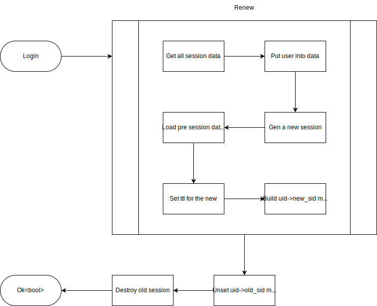
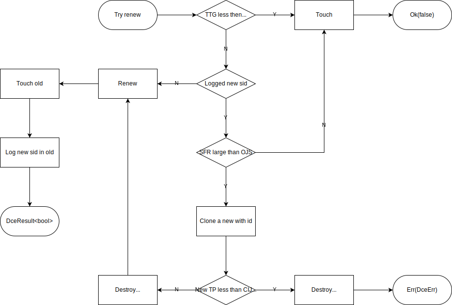

`dce-session` is a generic session manager (not exclusive to `dce`, can be integrated into any project), including basic session management, user session management, connection session management, self-regenerating session management, and the implementation of all the aforementioned session managers in the Redis version.

### Basic Session Management Traits

Basic session management traits mainly include some basic session storage interfaces, such as `get`, `set`, `del`, etc. Some of them with the `silent_` prefix indicate that this interface has silent and non-silent versions, where the non-silent version automatically `touch` (update session expiration time). There are also some interfaces starting with `cloned_`, used to handle some old sessions when regenerating sessions.

### User Session Management Traits

User session management traits encapsulate basic user session management interfaces, such as `user`, `login`, `logout`, etc.

#### User Session Flowchart

### Connection Session Management Traits

Connection session management traits are used to handle session management for long connections.

### Self-Regenerating Session Manager

The self-regenerating session manager is used to automatically regenerate a new ID for a session after a certain period of time, even if the session has not expired, to enhance session security.

#### Self-Regenerating Flowchart

*Abbreviation Notes*
- *TTG: Time To Generate, time when sid is generated*
- *SFR: Should-Regenerating-Sid timeout duration*
- *OJS: Old session delayed destruction duration*
- *CIJS: Duration of inactivity to judge when a new session should be destroyed*

## Redis Session

`RedisSession` is a built-in implementation of session management in `dce-session`, implementing the aforementioned "basic", "user", and "connection" session features, and can select which features to enable through control feature switches.

> For complete usage examples, please refer to the files prefixed with `session_` in the [src](../../src/apis) directory. For more comprehensive documentation, click [here](https://docs.rs/dce-session).